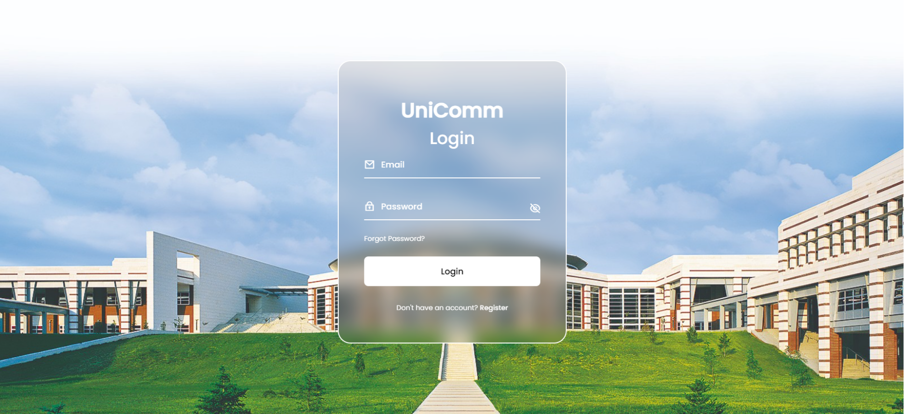
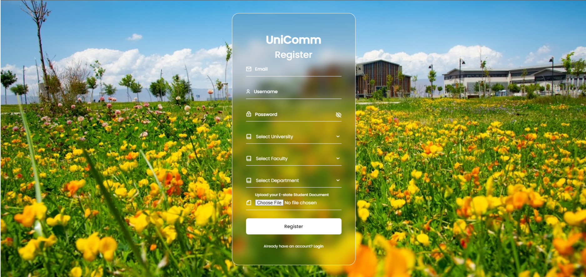
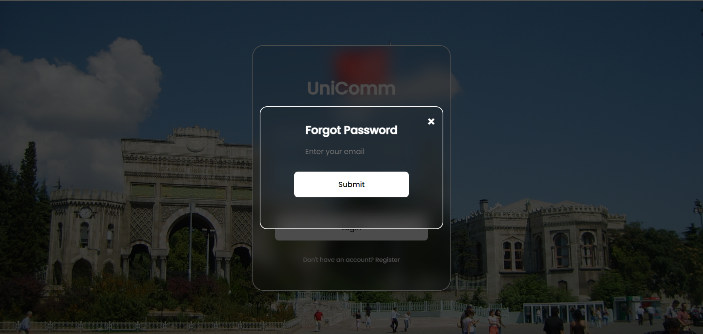
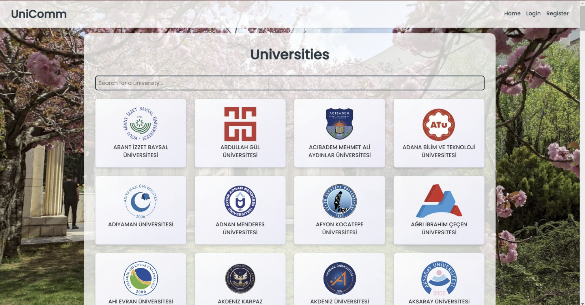
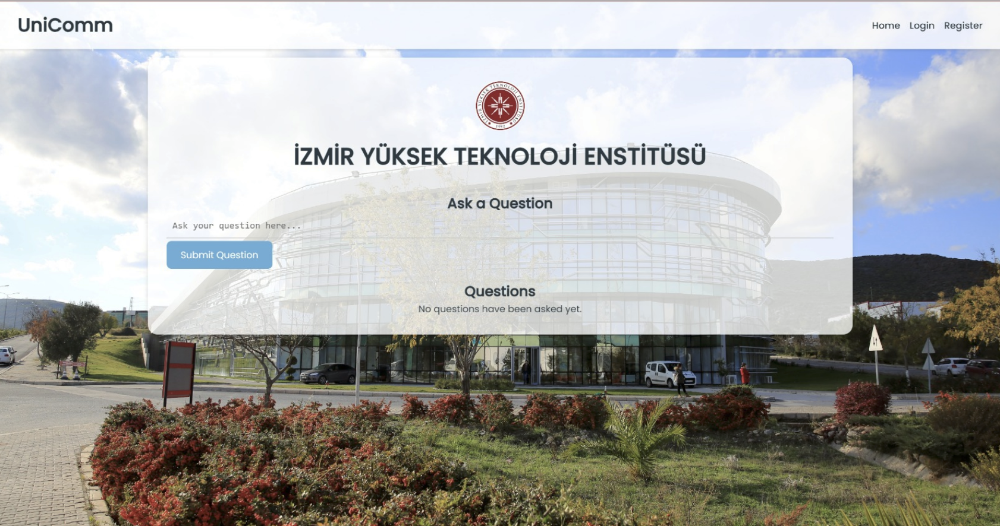
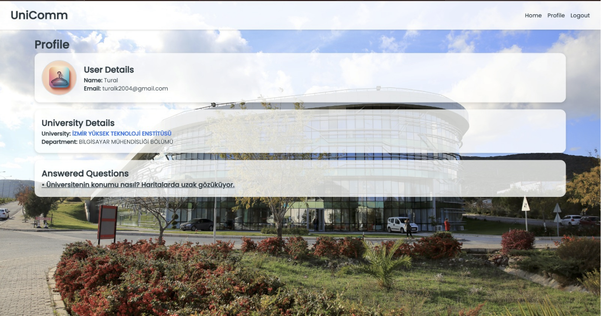
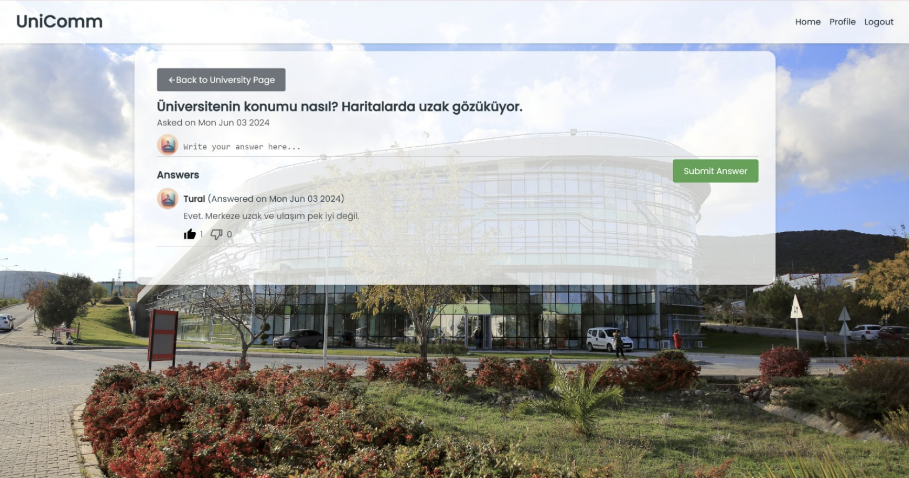
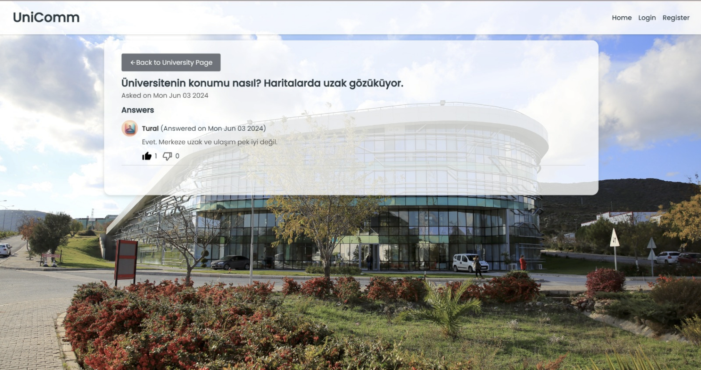

# UniComm 🎓

UniComm is a web-based platform designed to help high school students make informed university choices by providing **verified insights from university students and graduates**.

The platform allows users to explore universities, ask questions, read comments, and, if verified, contribute answers based on real experiences.

---

## ✨ Features

- 🔐 User authentication (Login / Register / Forgot Password)
- 🏫 University listing and search
- ❓ University-specific questions
- 💬 Comment and answer system
- ✅ Verified student system (only verified users can answer questions)
- 👤 User profile management
- 👀 Read-only access for non-logged-in users

---

## 🖼️ Screenshots

Below are screenshots of the main pages of the UniComm application.

### Login Page

### Register Page

### Forgot Password Page

### Home Page

### University Page

### User Profile Page

### Comments Page (Logged-in & Verified Users of Selected University)
Users can view and **answer** questions about universities.

### Comments Page (Not Logged-in Users)
Users can view comments but **cannot answer** questions.

---

## 🛠️ Technologies Used

- Frontend: HTML, CSS, JavaScript
- Backend: Node.js, Express.js
- Database: MongoDB
- Authentication & Authorization
- UI/UX Principles (HCI-based design)

---

## 👥 Team Members

- **Enes Bilal Çavdar**  
- **Enes Sezer** 
- **Tural Karimli**
- **Ahmet Said Barkahan** 

---

## 📌 Notes

- Only **verified university students** can answer questions.
- Guests can browse universities and read comments without logging in.
